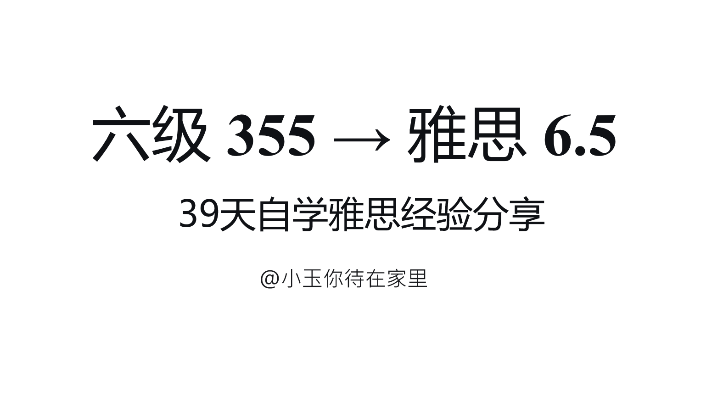

# IELTS 备考笔记

雅思考试备考资料与做题记录，涵盖听阅、写作和口语三大模块。



## 目录

```
├── PPT.pdf                          # 雅思备考讲义
├── 语料库自批改表格剑20_c.xlsx        # 剑20语料库自批改表
├── 笔记/
│   ├── 雅思报名信息.md
│   │
│   ├── 1-做题记录/          # 听力 & 阅读真题练习
│   │   ├── C14-T1.md
│   │   ├── C14-T2.md
│   │   ├── C18-T1.md ~ C18-T3.md
│   │   ├── C19-T1.md ~ C19-T4.md
│   │   ├── C20-T1.md ~ C20-T4.md
│   │   └── 同义词替换.md
│   │
│   ├── 作文/
│   │   ├── 做题技巧/         # 题型模板与策略
│   │   │   ├── 0.1-小作文通识积累.md
│   │   │   ├── 0.2-大作文通识积累.md
│   │   │   ├── 1-1 混合图.md
│   │   │   ├── 1-2 地图.md
│   │   │   ├── 1-3 流程图.md
│   │   │   ├── 2-1 Agree or disagree.md
│   │   │   ├── 2-2 Discuss both views.md
│   │   │   ├── 2-3 Reasons & Solutions.md
│   │   │   ├── 2-4 Positive & Negative.md
│   │   │   └── ai.md
│   │   └── 做题记录/         # 练习 & 批改
│   │       ├── 01-小作文/    # 表格、折线图、地图、流程图、混合图
│   │       └── 02-大作文/    # 观点、讨论、利弊类真题
│   │
│   └── 口语/
│       ├── P1/               # Part 1 日常话题（17个话题）
│       ├── P2/               # Part 2 独立陈述（12个话题）
│       └── P3/               # Part 3 深度讨论
```

## 
